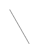
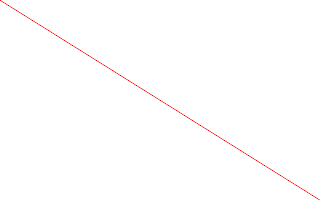
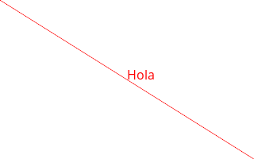

# Tutorial de ImageMagic
## Introducción

ImageMagick es un conjunto de herramientas que se usan desde la línea de comandos y que sirven para hacer operaciones con imágenes. Puede instalarse en Linux usando::

    sudo apt-get install -y imagemagick

Si se usa Windows puede instalarse desde [la web de ImageMagick](https://imagemagick.org/script/download.php)

## La herramienta ``convert``

``convert`` permite convertir imágenes de un formato a otro. Por ejemplo, podemos pasar una imagen de .BMP a .PNG haciendo esto::

    convert imagen.bmp imagen.png

### Haciendo dibujos

En realidad ``convert`` puede hacer muchas cosas más, como por ejemplo dibujar mediante un pequeño lenguaje. Esta operación exige al menos tres cosas:

* Un tamaño de la imagen que se va a generar. Esto se hace con el parámetro ``-size anchoxalto`` .
* Un color de fondo de la imagen. Se usa el parámetro ``xc:<color>``. 
* Un conjunto de operaciones. Se usa el parámetro ``-draw '<operaciones>' `` (Cuidado, en Windows se debe usar la comilla doble en lugar de la simple) 

Así, por ejemplo podemos construir una imagen llamada ``dibujo1.png`` usando esto::

    convert -size 100x100 xc:white -draw 'line 20,20,60,90' imagenes/dibujo1.png

Y obtenemos esto:

### Operaciones de dibujo
Se pueden usar estas primitivas:

* ``line x0,y0, x1,y1``.
* ``rectangle x0,y0, x1,y1``.
* ``text <x,y> 'Texto``

Delante de cada primitiva se puede poner el parámetro ``-fill <color>`` para indicar el color con el que se van a rellenar

Aquí tenemos un ejemplo que dibuja todo::

    convert -size 320x200 -fill red -draw 'line 0,0,320,200' -fill white -draw 'rectangle 0,0,320,200' xc:white imagenes/todo01.png

Esto devuelve esta imagen:

Como puede verse *no se ve la línea roja.* Esto se debe a que la linea se dibujó primero y despues se puso encima el rectángulo. Hagámoslo de otra manera::

    convert -size 320x200 -fill white -draw 'rectangle 0,0,320,200' -fill red -draw 'line 0,0,320,200'  xc:white imagenes/todo02.png

Que ahora da esto:

Añadamos además un poco de texto (observar el uso de las comillas dobles en el texto)::

    convert -size 320x200 -fill white -draw 'rectangle 0,0,320,200' -fill red -draw 'line 0,0,320,200'  -pointsize 16 -draw 'text 160,100 'Hola' ' xc:white imagenes/todo03.png

Que ahora da esto:

